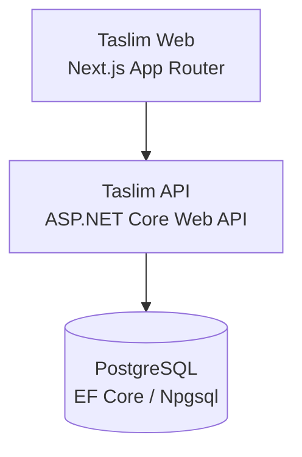

# Taslim.ai architecture

## Batch 1 system boundary



Taslim Web is responsible for the responsive product shell, navigation, localization, and user-facing placeholder experiences. Taslim API is the server boundary for future product operations. PostgreSQL is the persistence boundary, registered through `TaslimDbContext` and Npgsql in Batch 1 without a complete product schema.

The frontend must not connect directly to PostgreSQL. The API should own validation, authorization, persistence, orchestration, and integration boundaries as future features arrive.

## Future AI architecture

```text
Web
 |
 API
 |
 AI Core
 |
 Model Router
 |
 Provider Adapters
 |
 AI Providers
```

Future AI functionality will be accessed through the API rather than directly from browser clients. The AI Core and Model Router do not exist in Batch 1; this separation is documented now so that later batches can add them without coupling provider choices to UI components.

> **Security principle: NO AI provider secret or API key may ever be exposed to the browser.**

Provider credentials belong in server-side environment configuration or a managed secret store. Browser clients should call Taslim API endpoints using application-level contracts, never provider SDKs or provider credentials.

## Repository boundaries

| Area | Responsibility | Batch 1 status |
| --- | --- | --- |
| `apps/web` | Next.js App Router, responsive shell, data-driven UI, localization | Implemented |
| `apps/api` | ASP.NET Core pipeline, health endpoint, CORS, persistence registration | Implemented |
| `packages/contracts` | Shared schemas or generated contracts when needed | Reserved |
| `docs` | Technical and deployment documentation | Implemented |

The department UI is configured in `apps/web/src/lib/data.ts`, so new departments or feature cards can be added without duplicating component markup. Translation resources are kept in `apps/web/src/lib/i18n.ts`; visible UI components consume translation keys rather than hard-coded copy.

## Deployment model

The web and API services are independently deployable from the same monorepo. Railway should provide separate services rooted at `apps/web` and `apps/api`, plus a managed PostgreSQL service. Production URLs and connection strings are injected through environment variables; no production endpoint is hard-coded in source.

## Extension guidelines

1. Add a stable API contract before wiring a browser feature to backend behavior.
2. Keep provider adapters behind the API and AI Core boundary.
3. Add database entities deliberately with migrations in a later batch.
4. Add translations for every visible interface key in all launch languages.
5. Keep server-only secrets out of client bundles and `NEXT_PUBLIC_*` variables.
6. Preserve the responsive and RTL-safe shell when adding product areas.
