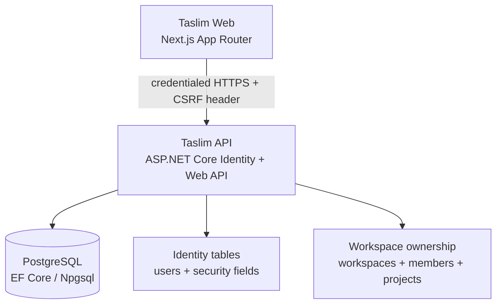

# Taslim.ai architecture

## Current system boundary



Taslim Web is responsible for the responsive product shell, navigation, localization, authentication screens, account preferences, and project workspace UI. Taslim API owns identity, cookie sessions, validation, authorization, persistence, and future orchestration boundaries. PostgreSQL is the persistence boundary.

The frontend must not connect directly to PostgreSQL. The API owns validation, authorization, persistence, and integration boundaries. Browser requests to private endpoints include credentials and a CSRF header; no bearer token is stored in localStorage.

## Ownership model

```text
ApplicationUser
  └── WorkspaceMember ── Workspace
                           ├── Projects
                           ├── Chats (future)
                           ├── Files (future)
                           ├── Assets (future)
                           └── Usage (future)
```

Projects and future resources belong to Workspaces. A new user automatically receives a Personal Workspace and an Owner membership. The membership model is deliberately separate from the user and workspace records so business workspaces and teams can be added later without restructuring the resource model.

Every private resource operation checks membership through the reusable `WorkspaceAccessService`. The API never trusts a workspace ID supplied by the browser without checking the authenticated user’s membership.

## Future AI architecture

```text
Web
 |
 API
 |
 AI Core
 |
 Model Router
 |
 Provider Adapters
 |
 AI Providers
```

Future AI functionality will be accessed through the API rather than directly from browser clients. The AI Core and Model Router do not exist in Batch 2; this separation is preserved so later batches can add them without coupling provider choices to UI components.

> **Security principle: NO AI provider secret or API key may ever be exposed to the browser.**

Provider credentials belong in server-side environment configuration or a managed secret store. Browser clients should call Taslim API endpoints using application-level contracts, never provider SDKs or provider credentials.

## Repository boundaries

| Area | Responsibility | Batch 2 status |
| --- | --- | --- |
| `apps/web` | Next.js shell, localization, auth/session state, account, projects | Implemented |
| `apps/api` | Identity, cookie sessions, CSRF, API contracts, authorization, persistence | Implemented |
| `apps/api.Tests` | Integration coverage for identity, ownership, and project lifecycle | Implemented |
| `packages/contracts` | Shared schemas or generated contracts when needed | Reserved |
| `docs` | Technical and deployment documentation | Implemented |

## Deployment model

The web and API services are independently deployable from the same monorepo. Railway should provide separate services rooted at `apps/web` and `apps/api`, plus managed PostgreSQL. The API remains Dockerfile-based. Production migrations are enabled through `appsettings.Production.json`, use a PostgreSQL advisory lock, and fail startup if they cannot be applied.

## Extension guidelines

1. Add a stable API contract before wiring a browser feature to backend behavior.
2. Keep provider adapters behind the API and AI Core boundary.
3. Add database entities deliberately with forward-safe migrations.
4. Add translations for every visible interface key in all launch languages.
5. Keep server-only secrets out of client bundles and `NEXT_PUBLIC_*` variables.
6. Preserve the responsive and RTL-safe shell when adding product areas.
7. Authorize resources through workspace membership rather than direct user ownership.
