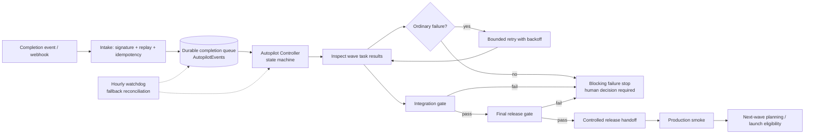

# Autopilot Controller Architecture (Foundation)

Status: foundation / infrastructure only. The controller is **disabled by default** (`Autopilot:Enabled = false`)
and runs in **dry-run simulation by default** (`Autopilot:DryRun = true`). No wave is launched and no release is
performed by this work.

This document describes the event-driven orchestration foundation that lets Taslim.ai development continue in
autonomous waves while every consequential product, business, security, or spending decision stays with a human.

## 1. Flow



Event-driven processing is primary. The hourly watchdog exists only to reconcile missed, lost, or out-of-order
events and to re-drive a wave whose completion evidence never arrived.

## 2. Components

| Area | File |
| --- | --- |
| Configuration and bounds | `apps/api/Autopilot/AutopilotOptions.cs` |
| Entities, run/task/event states | `apps/api/Autopilot/AutopilotEntities.cs` |
| Provider-neutral contracts | `apps/api/Autopilot/AutopilotContracts.cs` |
| HMAC signature verification and replay protection | `apps/api/Autopilot/AutopilotSecurity.cs` |
| Exclusive fenced lock | `apps/api/Autopilot/AutopilotLocks.cs` |
| State machine, retry, safety and human-decision policy | `apps/api/Autopilot/AutopilotPolicies.cs` |
| Durable intake queue | `apps/api/Autopilot/AutopilotEventIntake.cs` |
| Controller state machine | `apps/api/Autopilot/AutopilotOrchestrator.cs` |
| Hourly watchdog fallback | `apps/api/Autopilot/AutopilotWatchdogService.cs` |
| Administrator console projection | `apps/api/Autopilot/AutopilotConsoleService.cs` |
| Bridge intake endpoint | `apps/api/Controllers/AutopilotIntakeController.cs` |
| Administrator console endpoint | `apps/api/Controllers/AutopilotConsoleController.cs` |
| Provider-neutral wave-launch contracts | `apps/api/Autopilot/AutopilotWaveLaunchContracts.cs` |
| Manus Bridge wave-launch provider | `apps/api/Autopilot/ManusBridgeWaveLaunchProvider.cs` |
| Next-wave planning, launch, bounded polling | `apps/api/Autopilot/AutopilotNextWaveService.cs` |
| Next-wave eligibility and bounds | `apps/api/Autopilot/AutopilotNextWavePolicy.cs` |
| Launch/backlog entities | `apps/api/Autopilot/AutopilotWaveLaunchEntities.cs` |
| Backlog administration | `apps/api/Autopilot/AutopilotBacklogService.cs` |

## 3. Data model

All tables are created by the migration `20261002100839_AddAutopilotControllerFoundation`.

| Table | Purpose | Key constraints |
| --- | --- | --- |
| `AutopilotEvents` | Durable completion queue and intake audit | unique `(SourceSystem, ExternalEventId)`, unique `IdempotencyKey`, index `(Status, ReceivedAt)`, index `(Status, NextAttemptAt)` |
| `AutopilotRuns` | One autonomous wave under evaluation | unique `WaveKey`, immutable `BaseSha` / `CandidateSha` |
| `AutopilotWaveTasks` | Per-task evidence and state | unique `(RunId, TaskId)` |
| `AutopilotGateEvaluations` | Immutable gate evidence | unique `(RunId, GateKind, CandidateSha)` |
| `AutopilotReleaseHandoffs` | Controlled release handoff and smoke record | unique `RunId` |
| `AutopilotLocks` | Exclusive, fenced distributed lock | unique `ResourceKey`, `FencingToken` |
| `AutopilotAuditEvents` | Append-only decision log | indexed by `(CreatedAt, Action)` and `(WaveKey, CreatedAt)` |
| `AutopilotControlStates` | Single-row kill switch / pause state | unique `ControlKey` |
| `AutopilotWaveLaunchBatches` | One follow-on wave launch per source wave | unique `(SourceRunId, WaveKey)` |
| `AutopilotWaveLaunchTasks` | Per-task external identity, attempts, and reconciliation state | unique `(BatchId, TaskKey)`, unique `ExternalTaskId` when present |
| `AutopilotBacklogItems` | Human-approved unit of work | unique `ItemKey`, indexed `(Approved, Kind, ConsumedByWaveKey)` |

## 4. States

### 4.1 Event states

`received` → `queued` → `processing` → `processed`.

Terminal alternatives: `duplicate_ignored`, `rejected_unsigned`, `rejected_replay`, `rejected_invalid`, `failed`.

### 4.2 Run states

`planned` → `awaiting_events` → `in_progress` → `tasks_complete` → `integration_gate` →
(`integration_failed` | `release_gate`) → (`release_blocked` | `release_eligible`) →
(`handoff_pending_human` | `handoff_ready`) → `smoke_running` → (`smoke_failed` | `smoke_passed`) →
`next_wave_eligible` → `completed`. `paused` and `cancelled` are reachable from the active states.

Transitions are declared in `AutopilotStateMachine.RunTransitions`. An undeclared transition is rejected and
recorded as `invalid_transition` rather than guessed.

### 4.3 Task states

`pending` → `running` → `awaiting_result` → `succeeded` | `retry_scheduled` → … | `terminal_failed` | `blocked_human`.

## 5. Idempotency, duplicates, and replay

* Every intake event carries an identity pair `(SourceSystem, ExternalEventId)`; the derived
  `IdempotencyKey` is `autopilot:{source}:{externalEventId}`.
* A repeated delivery with an identical payload hash is acknowledged and recorded as `duplicate_ignored`. It is
  never re-applied.
* A repeated identity with a **different** payload is refused (`payload_conflict`); the controller will not
  reinterpret history.
* Concurrent duplicate inserts are resolved by the unique index; the losing writer reports `duplicate` instead of
  creating a second row.
* Gate evaluation is idempotent per `(run, gate kind, candidate SHA)`, so replaying an event can never launch a
  second integration or release for the same candidate.
* Webhook authenticity uses HMAC-SHA256 over `{timestamp}.{payload}` with a server-side secret and a bounded
  clock-skew window; a stale or unsigned event is rejected before anything is persisted.

## 6. Exclusive lock and fencing

Before any wave transition the controller acquires `autopilot:wave:{waveKey}` in `AutopilotLocks`.

* Only one holder exists per resource key (unique index).
* Acquisition is a conditional update guarded by the current fencing token and expiry, so a stale holder is
  fenced out when the lease expires and the token increments.
* A contended acquisition leaves the event `queued` with a short retry delay and records `lock.contended`.
* Duplicate events therefore cannot launch duplicate integrations, releases, or waves.

## 7. Immutable SHAs

The first event for a wave fixes the run's `BaseSha` and `CandidateSha`. Any later event that disagrees is
rejected at intake with `immutable_base_sha_conflict` or `immutable_candidate_sha_conflict`, recorded as a safety
stop, and the run is never repointed. The integration gate additionally requires every task's candidate SHA to
match the run's candidate SHA.

## 8. Bounded retries

* Only `ordinary` (deterministic CI/test/integration repair) and `infrastructure` failures may be retried.
* Attempts are bounded by `Autopilot:MaxTaskAttempts` (default 3). Exhaustion moves the task to
  `terminal_failed` and escalates to a human (`repair_escalation`).
* Backoff is exponential with a hard cap (`RetryBaseDelaySeconds`, `RetryMaxDelaySeconds`) plus bounded
  deterministic jitter. There is no unbounded loop anywhere in the controller.

## 9. Gates

### Integration gate

Requires **all** of:

* every wave task reported `succeeded` and the declared wave size is reached;
* no blocking failure class present;
* candidate SHA matches the run's immutable candidate SHA;
* `build`, `unit_tests`, `typecheck`, `integration_complete` passed;
* `browser_e2e` passed (when `RequireBrowserE2E` is true, the default);
* `migrations` passed (when `RequireMigrations` is true, the default).

### Final release gate

Requires a passed integration gate plus `security` and `accounting` checks, a matching candidate SHA, and no
blocking failure.

A failed gate is terminal for the wave until a human acts: the run moves to `integration_failed` or
`release_blocked`, records the failed check names, and sets `HumanDecisionRequired`.

## 10. Release handoff and production smoke

* In dry-run (default) the handoff and the production smoke are **simulated**: the handoff is recorded with
  `DryRun = true` and the run proceeds to `next_wave_eligible` so the whole pipeline is exercised safely.
* In live mode the handoff is prepared and left `awaiting_human`; the run parks in `handoff_pending_human` with
  `production_release` as the required decision. `AllowAutomaticRelease` defaults to `false` and must be
  explicitly enabled by a human for unattended release.
* `AllowAutomaticIntegrationMerge` also defaults to `false`.

## 11. Watchdog fallback

`AutopilotWatchdogService` runs on `Autopilot:WatchdogIntervalMinutes` (default 60) and:

1. requeues events stuck in `received`/`queued` past `EventStaleAfterMinutes`;
2. requeues events whose `processing` claim expired (crashed worker);
3. re-drives a run whose tasks are terminal but whose completion event never arrived;
4. stops reconciling an event after `MaxWatchdogReconciliations` and marks it `failed`
   (`watchdog_reconciliation_exhausted`) so the loop is bounded;
5. respects the kill switch, the pause flag, and the feature flag.

## 12. Restart and out-of-order recovery

* Nothing is held only in memory: intake, state, locks, and audit are all durable rows.
* A restarted process re-claims queued work; a claim that outlived its lease is recovered by the watchdog.
* Out-of-order events are applied idempotently: tasks are keyed by `(RunId, TaskId)` and a run only advances when
  its declared wave size is satisfied, so a late or missing event cannot produce a false "wave complete".

## 13. Audit log

Every decision writes an `AutopilotAuditEvent` containing: action, outcome, reason, status detail, wave key, task
id, run state, task state, attempt, branch, base SHA, candidate SHA, request id, dry-run flag, and timestamp.

The audit deliberately stores bounded summaries only. Prompts, provider payloads, credentials, and model names
are never written.

## 14. Secrets and exposure

* The signing secret is read from the server-side environment variable named by
  `Autopilot:SigningSecretEnvironmentVariable` (default `AUTOPILOT_WEBHOOK_SECRET`). It is never persisted,
  logged, or returned by any endpoint.
* The console is administrator-only (`TaslimAdminUsage` policy).
* All contracts are provider-neutral: no provider, model, or prompt names appear in the database, the audit log,
  or any API response.

## 15. Kill switch, pause, and resume

`AutopilotControlStates` holds a single control row. `POST /api/admin/autopilot/control` sets `paused` and/or
`killSwitch` with a mandatory reason and records `control.changed` in the audit log. While the kill switch is
engaged, no orchestration or reconciliation runs at all.

## 16. Concurrency

`Autopilot:MaxConcurrency` (default 20, hard-capped at 20) bounds how many queued events are examined per cycle.
Per-wave serialization is guaranteed by the exclusive wave lock, so concurrency never produces concurrent work on
one wave.

## 17. Configuration

| Key | Default | Meaning |
| --- | --- | --- |
| `Autopilot:Enabled` | `false` | Master feature flag |
| `Autopilot:DryRun` | `true` | Simulate instead of acting |
| `Autopilot:SimulationMode` | `true` | Operator-facing alias of dry-run |
| `Autopilot:WatchdogEnabled` | `true` | Register the hourly watchdog host |
| `Autopilot:MaxConcurrency` | `20` | Events examined per cycle (max 20) |
| `Autopilot:MaxTaskAttempts` | `3` | Bounded automatic retries |
| `Autopilot:RetryBaseDelaySeconds` | `30` | Backoff base |
| `Autopilot:RetryMaxDelaySeconds` | `900` | Backoff ceiling |
| `Autopilot:LockLeaseMinutes` | `15` | Wave lock lease |
| `Autopilot:WatchdogIntervalMinutes` | `60` | Hourly fallback cadence |
| `Autopilot:EventStaleAfterMinutes` | `30` | Missed-event threshold |
| `Autopilot:RequireSignedEvents` | `true` | Reject unsigned intake |
| `Autopilot:SignatureToleranceSeconds` | `300` | Replay window |
| `Autopilot:AllowAutomaticIntegrationMerge` | `false` | Human gate for merges |
| `Autopilot:AllowAutomaticRelease` | `false` | Human gate for releases |
| `Autopilot:ChargingEnabled` | `false` | Must stay off |
| `Autopilot:PaidProvidersEnabled` | `false` | Must stay off |
| `Autopilot:RequireBrowserE2E` | `true` | E2E evidence required by the integration gate |
| `Autopilot:RequireMigrations` | `true` | Migration evidence required by the integration gate |
| `Autopilot:MaxWatchdogReconciliations` | `24` | Bound on watchdog retries per event |

`ProductionConfigurationValidator` refuses to start production when charging or paid providers are enabled, when
signed events are disabled, or when the signing secret is absent while the controller is enabled. The staged
dry-run posture (`Enabled=true` with `DryRun=true`) is permitted; live execution requires `DryRun=false`
explicitly.

## 18. Completion signal contract

```json
{
  "waveKey": "wave-6",
  "taskId": "wave6-task-03",
  "outcome": "succeeded",
  "failureClass": "ordinary",
  "branch": "feature/example",
  "baseSha": "8bc3999d8a27f047e253a1f8832bd76e5c6dcb9a",
  "candidateSha": "1111111111111111111111111111111111111111",
  "attempt": 1,
  "evidence": "bounded, non-sensitive summary",
  "expectedTaskCount": 5,
  "waveComplete": false,
  "checks": {
    "build": true,
    "unit_tests": true,
    "typecheck": true,
    "lint": true,
    "browser_e2e": true,
    "migrations": true,
    "security": true,
    "accounting": true,
    "integration_complete": true
  },
  "requiresHumanDecision": false,
  "humanDecisionKind": null
}
```

HTTP delivery uses `POST /api/autopilot/events` with headers `X-Autopilot-Signature`,
`X-Autopilot-Timestamp`, `X-Autopilot-Source`, `X-Autopilot-Event-Id`, `X-Autopilot-Event-Type`.

## 19. Test coverage map

| Requirement | Test |
| --- | --- |
| Duplicate events | `Duplicate_events_are_stored_once_and_never_reapplied`, `Duplicate_processing_of_the_same_event_cannot_launch_a_second_gate`, `Events_with_a_reused_identity_but_different_payload_are_refused` |
| Missed events / watchdog | `Watchdog_reconciles_a_missed_completion_event`, `Watchdog_stops_reconciling_after_a_bounded_number_of_attempts` |
| Partial wave | `Partial_wave_stays_in_progress_and_only_advances_when_complete` |
| Failed task retry | `Ordinary_failure_is_retried_with_bounded_backoff_then_escalates`, `Blocking_failure_classes_stop_the_wave_without_retry` |
| Integration failure | `Integration_failure_blocks_release_gate_evaluation` |
| Gate failure | `Release_gate_failure_blocks_release_eligibility`, `Integration_gate_requires_all_evidence`, `Release_gate_requires_integration_plus_security_and_accounting` |
| Release eligibility | `Fully_green_wave_reaches_release_eligibility_and_next_wave_eligibility_in_simulation`, `Live_mode_requires_human_authorization_before_production_release` |
| Restart recovery | `Restart_recovery_requeues_an_inflight_event_and_reaches_terminal_state` |
| Lock contention | `Lock_contention_prevents_duplicate_processing_of_the_same_wave`, `Exclusive_lock_rejects_a_second_live_holder` |
| Safety stops | `Immutable_base_and_candidate_shas_cannot_be_repointed`, `Destructive_operations_are_never_permitted`, `Production_configuration_refuses_unsafe_autopilot_settings`, `Kill_switch_and_pause_stop_all_orchestration` |
| Staged activation | `Production_configuration_allows_staged_dry_run_activation`, `Production_configuration_refuses_unsafe_autopilot_settings` |
| Auditable log | `Audit_trail_records_reason_status_attempt_task_ids_branch_and_sha` |
| Exposure rules | `Consoles_expose_only_product_safe_state` |
| Endpoint wiring | `AutopilotEndpointTests` |

## 20. Deliberately out of scope

The following remain out of scope at every setting:

* Deploying to production, merging to main without a human, or touching production data.
* Enabling charging, paid providers, or any external generation provider.
* Executing destructive database operations (never implemented at any setting).
* Fabricating gate evidence: polling-derived completions carry no checks and can only escalate.

## 21. Next-wave launch (the previously missing execution loop)

The foundation stopped at `next_wave_eligible`. The follow-on execution loop now turns that
eligibility into a bounded, restart-safe launch of the next development batch through a
provider-neutral `IWaveLaunchProvider`, and reconciles launched work by bounded polling when a
signed completion event is missed. It never performs a release, a merge, a destructive operation,
or any paid action, and it selects work only from the pre-approved backlog.

See [AUTOPILOT_NEXT_WAVE_LAUNCH.md](AUTOPILOT_NEXT_WAVE_LAUNCH.md) for the eligibility rules, the
hard bounds, the polling-fallback safety analysis, the required production variables, and the
controlled activation flags.
