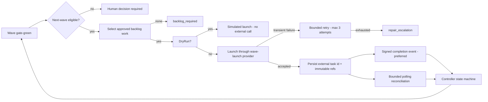

# Autopilot Next-Wave Launch — Autonomous Development Batches

This document describes the execution loop that continues Taslim.ai development
automatically after a wave completes successfully, and the exact boundary at which
the controller stops and a human decision is required.

It extends the event-driven controller foundation documented in
[docs/AUTOPILOT_CONTROLLER_ARCHITECTURE.md](AUTOPILOT_CONTROLLER_ARCHITECTURE.md) and the
activation runbook in [docs/AUTOPILOT_SAFE_ACTIVATION.md](AUTOPILOT_SAFE_ACTIVATION.md).
The foundation stopped at `next_wave_eligible`; this work turns that eligibility into a
bounded, provider-neutral, restart-safe launch.

## 1. What is new

| Area | File |
| --- | --- |
| Provider-neutral launch contracts | `apps/api/Autopilot/AutopilotWaveLaunchContracts.cs` |
| Manus Bridge implementation (`POST /v1/tasks`, `GET /v1/tasks/{id}`) | `apps/api/Autopilot/ManusBridgeWaveLaunchProvider.cs` |
| Launch planning, launching, bounded polling | `apps/api/Autopilot/AutopilotNextWaveService.cs` |
| Eligibility, bounds, deterministic wave keys | `apps/api/Autopilot/AutopilotNextWavePolicy.cs` |
| Durable launch/backlog entities | `apps/api/Autopilot/AutopilotWaveLaunchEntities.cs` |
| Backlog administration | `apps/api/Autopilot/AutopilotBacklogService.cs` |
| Controller wiring | `apps/api/Autopilot/AutopilotOrchestrator.cs` |
| Additive migration | `apps/api/Persistence/Migrations/20261002134838_AddAutopilotNextWaveLaunchAndBacklog.cs` |

## 2. Flow



## 3. Eligibility

A follow-on wave is planned only when **all** of the following hold:

1. the controller is enabled and neither paused nor kill-switched;
2. `Autopilot:AllowNextWaveLaunch` is `true`;
3. the source run is gate-green — both the integration gate and the final release gate passed;
4. the source run state is `next_wave_eligible`, `smoke_passed`, `handoff_ready`, or `handoff_pending_human`;
5. no product, security, pricing, or schema decision is outstanding on the source run;
6. if the only outstanding decision is the production release, `Autopilot:AllowNextWaveLaunchWhenReleasePending`
   must be `true` — otherwise the batch is recorded as blocked with `release_pending_human`.

The condition in step 6 exists because the source wave is *released* by a human while the *next
development batch* is ordinary build work. Keeping the two separate is what allows development to
continue without giving the controller release authority.

## 4. Planning

* Only backlog items with `Approved = true`, `Kind = development`, and no `ConsumedByWaveKey` may be selected.
* Selection is ordered by `Priority`, then `CreatedAt`, and is capped by `Autopilot:MaxTasksPerWave`
  (default 20, hard cap 20).
* The follow-on wave key is `{sourceWaveKey}-next`, derived deterministically, so a restart or a
  replayed pass resolves to the same wave.
* The batch stores a stable plan fingerprint; a changed plan for the same wave is refused.
* Every task records its backlog key, a bounded human title, the immutable base ref
  (the source run's candidate SHA), and the branch.
* If no approved development work exists, the batch is recorded as `blocked` with
  `backlog_required` and a `human.decision_required` audit entry. The loop resumes automatically
  once a human approves work; nothing is ever invented.

## 5. Launching

* `Autopilot:DryRun = true` (default) simulates the launch: the batch and tasks are recorded as
  `simulated`, **no external call is made**, and no backlog item is consumed. Simulation is
  removable in place when dry-run is turned off.
* Live launch calls `IWaveLaunchProvider`. The shipped implementation
  (`ManusBridgeWaveLaunchProvider`) calls the already-deployed bridge contract
  `POST /v1/tasks` with `Authorization: Bearer $TASLIM_BRIDGE_TOKEN` and an
  `Idempotency-Key: autopilot:{waveKey}:{taskKey}` header, and reads state with
  `GET /v1/tasks/{id}`.
* A 2xx response without a resolvable task identity, a non-2xx response, a timeout, an
  unreachable bridge, or an unreadable body is **never** treated as a launch.
* Transient failures (5xx, 408, 429, network) are retried up to `Autopilot:MaxLaunchAttempts`
  (default 3, hard cap 3) with bounded backoff. Deterministic refusals (4xx) are not retried;
  both terminal cases escalate to a human with `repair_escalation`.
* A live launch with an unconfigured provider is refused before any call, with
  `provider_not_configured`.
* Every attempt is claimed with a conditional database update (status `launching`), so two workers
  can never launch the same task; a claim older than `Autopilot:LockLeaseMinutes` is recovered.

## 6. Reconciliation of launched work

Signed completion events remain the preferred path — `POST /api/autopilot/events` is unchanged and a
signed event always wins. The polling fallback exists only for missed webhooks and restarts:

* Only tasks in `launched` state, due at `NextReconcileAt` (first poll after
  `Autopilot:PollingFallbackAfterMinutes`, default 30), and below `Autopilot:MaxLaunchReconciles`
  (default 24) are polled.
* If the corresponding wave task is already terminal, the launch is reconciled as
  `signed_event_completed` and no polling occurs.
* A terminal state observed by polling produces a **controller-internal, unsigned** completion
  event (`source = autopilot-poll`, `signatureVerified = false`) that is submitted through a
  separate in-process intake path — never through the HTTP intake.
* Exhausting the reconcile bound records `blocked` + `reconcile_exhausted` and escalates to a human.

### Can completion events safely be produced from polling?

**Yes, for liveness and escalation; no, for gate evidence.** The derived signal deliberately carries
no check evidence (`checks = null`) and no SHAs. Because the integration gate requires
`build`, `unit_tests`, `typecheck`, `integration_complete`, `browser_e2e`, and `migrations`, a
poll-only wave can only ever reach `integration_failed` — it can never fabricate a green gate and it
can never release anything. This makes polling a safe, fail-closed fallback without changing the
bridge: it tells a human "the task ended but its evidence never arrived".

Signed completion evidencing remains the only way a wave can pass its gates.

## 7. Hard bounds

| Bound | Setting | Default | Hard cap |
| --- | --- | --- | --- |
| Tasks per follow-on wave | `Autopilot:MaxTasksPerWave` | 20 | 20 |
| Launch attempts per task | `Autopilot:MaxLaunchAttempts` | 3 | 3 |
| Batches examined per cycle | `Autopilot:MaxLaunchBatchesPerCycle` | 20 | 20 |
| Tasks polled per cycle | `Autopilot:MaxLaunchReconciliations` | 20 | 50 |
| Polls per launched task | `Autopilot:MaxLaunchReconciles` | 24 | 100 |
| First poll delay | `Autopilot:PollingFallbackAfterMinutes` | 30 | 5..1440 |
| Poll backoff base | `Autopilot:LaunchReconcileBackoffSeconds` | 300 | 30..86400 |

There is no unbounded loop: every pass is bounded by a configured maximum, every retry is bounded by
an attempt counter, and one follow-on wave per source wave is enforced by a unique index on
`(SourceRunId, WaveKey)`.

## 8. Never performed, at any setting

* automatic production release (`AllowAutomaticRelease` stays `false`);
* automatic integration merge into `main` (`AllowAutomaticIntegrationMerge` stays `false`);
* charging or paid providers (`ChargingEnabled`, `PaidProvidersEnabled` stay `false`);
* force push, production database reset, production data drop, charging-guard removal;
* gate bypass — a poll-derived or otherwise incomplete wave can never pass a gate;
* work that was not explicitly approved in the backlog.

## 9. Required production variables

| Variable | Required when | Purpose |
| --- | --- | --- |
| `AUTOPILOT_WEBHOOK_SECRET` | `Autopilot:Enabled=true` | HMAC secret for signed completion events |
| `Autopilot__BridgeBaseUrl` | `AllowNextWaveLaunch=true` and `DryRun=false` | Bridge HTTPS endpoint |
| `TASLIM_BRIDGE_TOKEN` | `AllowNextWaveLaunch=true` and `DryRun=false` | Bearer credential for `POST /v1/tasks` |

Production startup refuses to boot when live next-wave launch is requested without the bridge URL or
the bridge credential, when charging or paid providers are enabled, or when signed events are
disabled while the controller is enabled.

## 10. Controlled activation flags

Stage 1 — observe (no external action):

```
Autopilot__Enabled=true
Autopilot__DryRun=true
Autopilot__AllowNextWaveLaunch=true
Autopilot__AllowNextWaveLaunchWhenReleasePending=false
Autopilot__AllowAutomaticRelease=false
Autopilot__AllowAutomaticIntegrationMerge=false
Autopilot__ChargingEnabled=false
Autopilot__PaidProvidersEnabled=false
```

Stage 2 — supervised live development batches (release still human):

```
Autopilot__Enabled=true
Autopilot__DryRun=false
Autopilot__AllowNextWaveLaunch=true
Autopilot__AllowNextWaveLaunchWhenReleasePending=true
Autopilot__BridgeBaseUrl=https://<bridge-host>
TASLIM_BRIDGE_TOKEN=<server-side only>
Autopilot__AllowAutomaticRelease=false
Autopilot__AllowAutomaticIntegrationMerge=false
Autopilot__ChargingEnabled=false
Autopilot__PaidProvidersEnabled=false
```

Shipped defaults remain `Enabled=false`, `DryRun=true`, `AllowNextWaveLaunch=false`, so a deployment
without these variables never launches anything.

## 11. Operating the loop

```bash
# See the follow-on wave batches, including blocked batches and their reason
curl https://<api>/api/admin/autopilot/next-waves --cookie 'taslim.auth=<session>'

# Approve ordinary development work (a human decision; reason mandatory)
curl -X POST https://<api>/api/admin/autopilot/backlog \
  -H 'Content-Type: application/json' -H "X-CSRF-TOKEN: <token>" \
  --cookie 'taslim.auth=<session>' \
  -d '{"itemKey":"bl-42","title":"Add workspace audit export","kind":"development","approved":true,"priority":10,"reason":"approved at the 2026-10-02 planning review"}'

# Read the approved backlog
curl https://<api>/api/admin/autopilot/backlog --cookie 'taslim.auth=<session>'

# Force one bounded launch + reconciliation pass
curl -X POST https://<api>/api/admin/autopilot/reconcile \
  -H 'Content-Type: application/json' -H "X-CSRF-TOKEN: <token>" \
  --cookie 'taslim.auth=<session>' -d '{"reason":"bridge gap 2026-10-02"}'

# Stop all future launches immediately
curl -X POST https://<api>/api/admin/autopilot/control \
  -H 'Content-Type: application/json' -H "X-CSRF-TOKEN: <token>" \
  --cookie 'taslim.auth=<session>' -d '{"killSwitch":true,"reason":"incident"}'
```

The overview endpoint (`GET /api/admin/autopilot/overview`) now also returns `nextWaveLaunches` and
`backlog`, so the console shows what was launched, what is blocked, and why.

## 12. Incident playbook additions

| Symptom | Action |
| --- | --- |
| Batch blocked with `backlog_required` | Approve ordinary development items; the loop resumes automatically |
| Batch blocked with `release_pending_human` | Release (or decide) the source wave, or set `AllowNextWaveLaunchWhenReleasePending=true` |
| Batch blocked with `provider_not_configured` | Set `Autopilot:BridgeBaseUrl` and the bridge credential, then redeploy |
| Batch in `failed` with `launch_attempts_exhausted` | Inspect the bridge, then raise `MaxLaunchAttempts` (≤3) to permit new attempts |
| Launched task stuck in `launched` | The bounded polling fallback reconciles it; `reconcile_exhausted` escalates to a human |
| Duplicate launches suspected | The unique index on `(SourceRunId, WaveKey)` and the `launching` claim make this impossible; inspect the batch row and audit trail |
| Poll-only wave failed its integration gate | Expected and correct: polling cannot supply check evidence. Recover the evidence and deliver a signed completion event |

## 13. Test coverage map

| Requirement | Test |
| --- | --- |
| Live next-wave launch | `Live_next_wave_launch_creates_the_next_wave_tasks_and_keeps_release_human` |
| Dry-run performs no external call | `Dry_run_simulation_never_performs_an_external_call` |
| Bridge unavailable → bounded retry | `Unavailable_bridge_is_retried_within_bounds_then_requires_a_human` |
| Restart recovery | `Restart_recovery_retries_a_planned_launch_and_recovers_a_stale_claim` |
| Duplicate events → no duplicate task | `Duplicate_processing_never_creates_a_duplicate_next_wave_task` |
| Missing backlog → human decision | `Missing_approved_backlog_stops_with_a_human_decision_and_resumes_when_supplied` |
| Kill switch | `Kill_switch_prevents_future_launches` |
| Max task count 20 | `Wave_task_count_is_capped_at_twenty` |
| Human decisions block the wave | `Product_and_release_decisions_block_the_next_wave_until_explicitly_allowed` |
| Provider configuration missing | `Missing_provider_configuration_blocks_live_launch_without_any_call` |
| Polling fallback is fail-closed | `Polling_fallback_detects_terminal_state_and_can_never_satisfy_a_gate` |
| No secrets exposed | `No_secret_material_is_persisted_in_launch_state_or_audit`, `Bridge_provider_is_fail_closed_and_never_exposes_its_credential` |
| Policy invariants | `Next_wave_policy_is_deterministic_and_never_releases_or_pushes` |
| Administrator surface | `AutopilotNextWaveEndpointTests` |