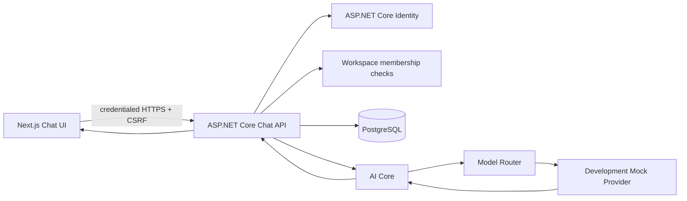

# Taslim Chat and AI Core Architecture

Batch 3.1 adds the foundation for Taslim Chat without connecting a paid AI provider. The implementation keeps the product boundary stable: the browser calls the Taslim API, the API owns authorization and persistence, and the AI Core selects a provider through interfaces rather than vendor-specific application code.

## System flow

A state-changing chat request is authenticated, checked against the conversation owner and workspace membership, validated for size and state, and then persisted. The user message is saved before generation starts. An assistant message is created as `Pending`, passed through the provider-independent AI Core, and finalized as `Completed` or `Failed`. Provider internals are not returned to ordinary users.

## Persistence model

`Conversation` belongs to one workspace and one authenticated user. It may optionally reference a project, which allows project-scoped context to be introduced later without mixing it into personal memory. A conversation has an explicit `Active` or `Archived` status and timestamp fields for deterministic history ordering.

`ChatMessage` belongs to one conversation and stores a role, content, status, creation time, and nullable execution metadata. The supported roles already include `User`, `Assistant`, `System`, and `Tool`; normal message history endpoints return only user and assistant messages. `AttachmentManifestJson` is reserved for future external file references and intentionally does not store file blobs in PostgreSQL.

| Entity | Important fields | Access boundary |
| --- | --- | --- |
| Conversation | WorkspaceId, ProjectId?, UserId, Title, Status, LastMessageAt | Authenticated owner and workspace member |
| ChatMessage | ConversationId, Role, Content, Status, execution metadata | Through its authorized conversation |

Indexes support owner/workspace/status/recency conversation lists, workspace recency queries, and stable conversation message ordering.

The migration `AddChatConversationsAndMessages` adds the tables, foreign keys, indexes, and restrictive deletion behavior. Production uses the existing EF Core migration runner; the application does not call `EnsureCreated`.

## AI Core

The application depends on three provider-independent contracts:

- `IAiProvider` adapts a provider to a normalized `AiChatRequest` and `AiGenerationResult`.
- `IAiModelRouter` chooses a provider/model selection from a normalized request.
- `IChatCompletionService` coordinates routing and provider execution for the application layer.

The normalized execution metadata supports provider key, model key, token counts, estimated and actual cost, latency, finish reason, and a test-response marker. These fields are persisted on assistant messages for future usage accounting, but Batch 3.1 does not charge credits and does not fabricate token counts or cost.

The current router selects the clearly labeled `mock` provider and `taslim-mock-chat` model. No OpenAI, Anthropic, Google, or other vendor SDK or endpoint is referenced by the Taslim Chat implementation. A future provider adapter can be added behind `IAiProvider` without changing the conversation API or message schema.

## Mock provider behavior

The mock provider is development-only and never performs a network call. `Hello Taslim` returns:

> Hello! Taslim Chat is connected and ready.

Other messages receive a clearly labeled development response. The API marks the assistant response with `isTestResponse`, and the frontend displays a **Development response** badge. This prevents a mock result from being presented as a production model response. The reserved `[[mock-failure]]` sentinel exercises failure handling in integration tests; it is not a user-facing feature.

## API surface

| Method | Endpoint | Purpose |
| --- | --- | --- |
| `POST` | `/api/workspaces/{workspaceId}/conversations` | Create an authorized conversation |
| `GET` | `/api/workspaces/{workspaceId}/conversations?status=Active\|Archived` | List the current user’s conversations |
| `GET` | `/api/conversations/{conversationId}` | Get one authorized conversation |
| `GET` | `/api/conversations/{conversationId}/messages` | Get visible user/assistant history |
| `PATCH` | `/api/conversations/{conversationId}` | Rename an authorized conversation |
| `POST` | `/api/conversations/{conversationId}/archive` | Archive an authorized conversation |
| `POST` | `/api/conversations/{conversationId}/messages` | Persist a user message, execute AI Core, and persist the assistant result |

All mutation endpoints use the existing CSRF architecture. The authenticated user is always derived from the Identity claims; the browser cannot provide a `UserId` authority. Unauthorized conversation IDs return a safe not-found response without content leakage.

## Failure and retry behavior

The user message remains persisted if AI generation fails. The assistant message is marked `Failed`, and the API returns a safe `AI_GENERATION_FAILED` response. Server logs include identifiers and trace context but never complete private message contents, passwords, cookies, tokens, or provider secrets. The persistence shape leaves room for a future idempotency key and retry policy without requiring a destructive redesign.

## Privacy boundaries

Conversation history is stored chat content. Personal Memory and Project Memory are separate future concepts and are not derived automatically from conversation history in Batch 3.1. No embeddings, vector database, retrieval, tool calls, agents, file analysis, or automatic translation are included.

## Frontend routes

- `/chat` opens a new-chat state with authorized conversation history in the sidebar.
- `/chat/{conversationId}` loads the authorized conversation and visible messages.

The chat interface supports English, Arabic, and Kurdish Sorani. The existing locale provider controls document direction, so Arabic and Kurdish retain RTL behavior. Desktop uses a history sidebar and main composer; mobile collapses the history into a compact horizontal rail.

## Future integration path

The next controlled batch can add a real provider adapter, configuration-backed model catalog, health checks, fallback selection, and optional streaming. Those capabilities should implement the existing AI Core contracts rather than introducing provider calls into controllers or frontend code. Usage ledger and billing integration should consume the normalized execution metadata after a real provider is connected.
