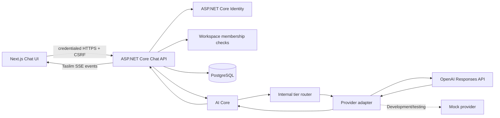

# Taslim Chat and AI Core Architecture

Batch 3.2 connects Taslim Chat to its first production provider while preserving provider independence. The browser never calls OpenAI directly. The browser calls the Taslim API, which authorizes the request, constructs server-controlled context, routes to an internal capability tier, invokes a provider adapter, and returns provider-independent streaming events.

## System flow



The application layer does not contain OpenAI-specific logic. `ChatController` depends on `IChatCompletionService`; the frontend consumes `message.started`, `message.delta`, `message.completed`, and `message.failed`. Provider payloads, model IDs, authorization headers, and internal routing metadata never cross the normal user-facing API boundary.

## AI Core

The core contracts are:

- `IAiProvider`, which adapts a provider to normalized requests and stream events.
- `IAiModelRouter`, which maps internal Taslim capability tiers to an enabled provider/model.
- `IChatCompletionService`, which coordinates routing, provider execution, and usage enrichment.
- `AiContextBuilder`, which applies the server instruction and context budget before routing.

Taslim uses three internal tiers:

| Internal tier | Initial internal model | User-visible model selection |
| --- | --- | --- |
| Fast | `gpt-5.6-luna` | Not exposed |
| Smart | `gpt-5.6-terra` | Not exposed; default |
| Advanced | `gpt-5.6-sol` | Not exposed |

The default is configured with `Ai__DefaultChatTier=Smart`. The current router is deterministic and configuration-driven. It is intentionally not an automatic classifier. A future router can analyze task characteristics while retaining the same contract.

## OpenAI adapter

`OpenAiProvider` is registered behind `IAiProvider`. It calls the official Responses API at the configured server-side base URL, sends the authoritative `instructions` value, passes original Unicode conversation content unchanged, requests `stream: true`, and converts OpenAI SSE events into Taslim events. It recognizes `response.output_text.delta`, `response.completed`, and provider error/failure events.

The OpenAI API key is read only from `Ai__OpenAI__ApiKey` on the API service. It is never sent to the browser, compiled into Next.js, returned in a response, or written to logs. Provider errors are logged with provider/model identifiers and trace context, never with authorization headers or response secrets.

Production does not fall back silently to the mock provider. `appsettings.Production.json` sets `Ai:AllowMockProvider=false`. When OpenAI is disabled or unavailable in Production, the API returns a safe generation failure and persists the assistant message as `Failed`.

## Configuration-backed model catalog

The catalog is loaded from `Ai:Models` and has safe code defaults for local/test startup. It stores provider key, internal model key, enabled state, streaming/vision/tool capabilities, context window, cost tier, capability tier, and prices. The initial configured prices were verified against the official OpenAI pricing page on September 19, 2026:

| Internal model | Input / 1M | Cached input / 1M | Output / 1M |
| --- | ---: | ---: | ---: |
| `gpt-5.6-luna` | $0.20 | $0.02 | $1.20 |
| `gpt-5.6-terra` | $2.00 | $0.20 | $12.00 |
| `gpt-5.6-sol` | $4.00 | $0.40 | $20.00 |

These are internal accounting values, not user-facing pricing. Taslim does not charge users in Batch 3.2.

## Server-controlled system instruction

The API supplies this instruction from configuration:

> You are Taslim, a helpful multilingual AI assistant. Provide clear, accurate and useful answers. Respond naturally in the user's language unless they request another language.

The browser cannot replace or append an authoritative system instruction. The configuration location leaves room for future safety, product behavior, memory, project context, and tool instructions without introducing those systems in this batch.

## Context construction and budget

For each request, the API loads only completed user and assistant messages from the authorized conversation. Failed assistant messages, provider metadata, billing metadata, and database implementation details are excluded. The current user message is saved before context construction, so it is included in the request.

`AiContextBuilder` estimates tokens conservatively from Unicode content and retains the newest messages within `Ai__ContextBudgetTokens`, while preserving the latest user message. The initial default is 12,000 estimated tokens. Older turns are trimmed rather than summarized with another paid model. Personal memory, project memory, embeddings, RAG, and retrieval are not implemented.

## Streaming contract

The browser calls:

```text
POST /api/conversations/{conversationId}/messages/stream
```

The response is Taslim-owned Server-Sent Events. The API sends `Content-Type: text/event-stream; charset=utf-8`, `Cache-Control: no-cache, no-transform`, `Pragma: no-cache`, and `X-Accel-Buffering: no` before flushing each event. The current event contract is:

| Event | Payload purpose |
| --- | --- |
| `message.started` | Conversation, user message, and pending assistant message |
| `message.delta` | Assistant message ID and incremental Unicode text |
| `message.completed` | Final conversation, user message, assistant message, and safe test marker |
| `message.failed` | Safe error code/message suitable for retry UI |

Raw OpenAI events are never forwarded. The frontend updates the pending assistant message as deltas arrive, keeps the composer disabled while generation is active, auto-scrolls without replacing user-controlled history navigation, and provides a localized retry action after failure.

The frontend parser is line-oriented and tolerant of LF, CRLF, mixed line endings, arbitrary fetch-chunk boundaries, multiple events per chunk, multi-line `data` fields, comments, and a final event at EOF. It rejects malformed Taslim JSON, unsupported event names, events after a terminal event, and streams that close without `message.completed` or `message.failed`. These protocol errors release the generating state and expose the existing recoverable retry path rather than leaving a permanent typing indicator.

The existing synchronous endpoint remains available for compatibility and Home → Ask Taslim. It uses the same AI Core, persistence, routing, context, and failure rules.

## Persistence safety and idempotency

A state-changing request follows this order:

1. Authenticate and authorize the conversation.
2. Validate message size and request ID.
3. Look up the conversation/request ID pair.
4. Save the user message and a pending assistant message before provider execution.
5. Stream deltas while accumulating the assistant response server-side.
6. Persist final content, status, provider/model metadata, usage, cost, and timestamps only after completion.
7. On failure or cancellation, preserve the user message and mark the assistant `Failed`.

The frontend generates a request ID for each send. The database stores it on the user message and enforces a unique filtered index per conversation. A repeated completed request returns the existing result without another provider call. A repeated pending request returns a safe conflict. A failed request may be intentionally retried using the same request ID, resetting the failed assistant message instead of creating another user message.

Each persisted chat message also has a monotonically increasing `Sequence` within its conversation. User and assistant rows are allocated consecutive sequence values before provider execution, and all history/context queries order by sequence before timestamp and ID fallbacks. The `AddDeterministicChatMessageOrdering` migration backfills existing rows using `CreatedAt`, places user rows before assistant rows for equal timestamps, and updates each conversation's next sequence value. This is deterministic for all existing data and uses the strongest relationship signals available from the pre-sequence schema without corrupting rows.

## Usage and cost accounting

The OpenAI adapter captures input tokens, cached input tokens where supplied, output tokens, latency, and finish status from the provider response. The AI Core calculates internal estimated/actual cost from the configuration-backed catalog. No fabricated usage is stored when a provider fails, and no user billing or credit deduction occurs.

## Failure, timeout, and cancellation behavior

Provider requests use a bounded timeout configured by `Ai__ProviderTimeoutSeconds`. If the provider returns an error, times out, or emits a failure event, the API logs safe diagnostics, marks the pending assistant message as `Failed`, preserves the user message, and emits/returns `AI_GENERATION_FAILED`. If the browser disconnects, the linked cancellation token stops the provider stream and the persistence cleanup path marks the assistant failure state. No failed request is silently converted into a simulated response.

## Security and privacy boundaries

The existing security architecture remains intact: Identity cookies are HttpOnly and Secure in Production, SameSite and credentialed CORS behavior is unchanged, CSRF is required for chat mutations, forwarded HTTPS handling remains early in the pipeline, and workspace/conversation authorization is enforced server-side. Provider secrets, cookies, CSRF tokens, complete private conversation content, and passwords are never logged.

Normal Taslim users see Taslim Chat as one intelligent product. OpenAI, GPT labels, internal model IDs, router details, token counts, and provider metadata are not returned in ordinary conversation DTOs. The development-only mock response marker is retained for local/testing clarity and is not used as a Production fallback.

## Deployment

The API service requires these Railway variables:

```text
Ai__OpenAI__Enabled=true
Ai__OpenAI__ApiKey=<SECRET>
Ai__DefaultChatTier=Smart
```

The optional base URL is already defaulted to `https://api.openai.com/v1`; set `Ai__OpenAI__BaseUrl` only when a compatible server-side endpoint is intentionally used. Put these variables only on **Taslim API**, never on Taslim Web. The EF migrations `AddChatUsageAndIdempotency` and `AddDeterministicChatMessageOrdering` are applied through the existing Production startup migration runner.

## Scope boundary

Batch 3.2 and 3.3 do not add Anthropic, Gemini, provider fallback, web search, image/video/voice/music generation, file analysis, personal memory, project memory, embeddings, RAG, agents, billing, subscriptions, credit deduction, or native mobile apps. Batch 3.3 adds only the internal usage ledger and zero-charge accounting foundation; Batch 3.4 was not started.

## Batch 3.3 usage ledger boundary

The extensible `UsageTransaction` ledger records workspace and user ownership, optional project and conversation references, request id, feature, provider/model metadata, token usage, provider cost, customer charge, lifecycle status, timestamps, and a safe failure code. It never stores prompts, assistant text, credentials, cookies, authorization headers, or raw provider payloads.

Both normal and streaming chat create one Pending transaction using the unique `WorkspaceId + RequestId + Feature` key. Provider success records usage and calculates decimal provider cost from the existing model catalog before transitioning the transaction to Completed. Provider failure transitions it to Failed, stores only a safe failure code, and sets customer charge to zero. The charging abstraction is currently a safe no-charge implementation; Stripe, subscriptions, credit purchases, and plan limits remain outside this batch.
